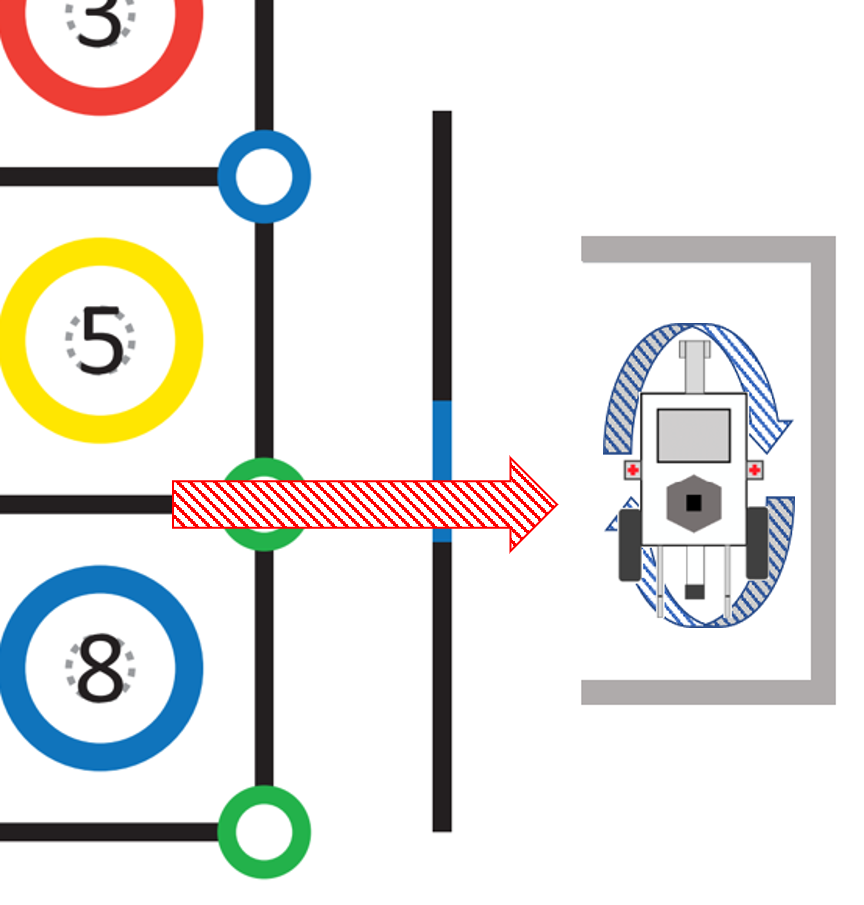
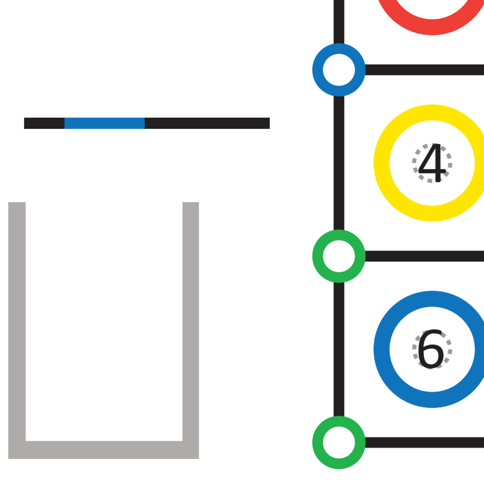

# ガレージ駐車

## 用語について

用語は以下の2つの図で使用されている用語を使用する。

---

## Lコース

Lコースのガレージは下の図のようになっている

走行体の動きとしては次の図のような動きを予定している。

1. ブロックサークル5と8のサークルの間の直線から駐車領域(AL)前の青線まで前進する。
2. 青線から駐車領域(AL)に走行体の前半分が入るまで前進する。
3. 右に旋回する。
4. 3秒間停車する。

---

## Rコース

Rコースのガレージは下の図のようになっている

 

走行体の動きとしては次の図のような動きを予定している。

1. ブロックサークル1と4の間の直線からブロックサークル4のブロックサークルの左上にある青の交点サークルまで進む。
2. Lコース(画像の左)側を向く。
3. 一定距離、前進したら左に旋回する。
4. ガレージ(AR)前の黒線まで前進する。
5. 右に旋回する。
6. 青線の中央まで前進する。
7. 左に旋回する。
8. 駐車領域(AR)に走行体全体が入るまで前進する。
9. 3秒間停車する。

---

## 必要な機能

- 色を識別する機能(実装済み、ただし精度が低い)
- 指定した距離を移動する機能(実装済み)
- 指定した角度だけ旋回する機能(実装済み)

---

## 課題

- 色識別の精度を上げる
